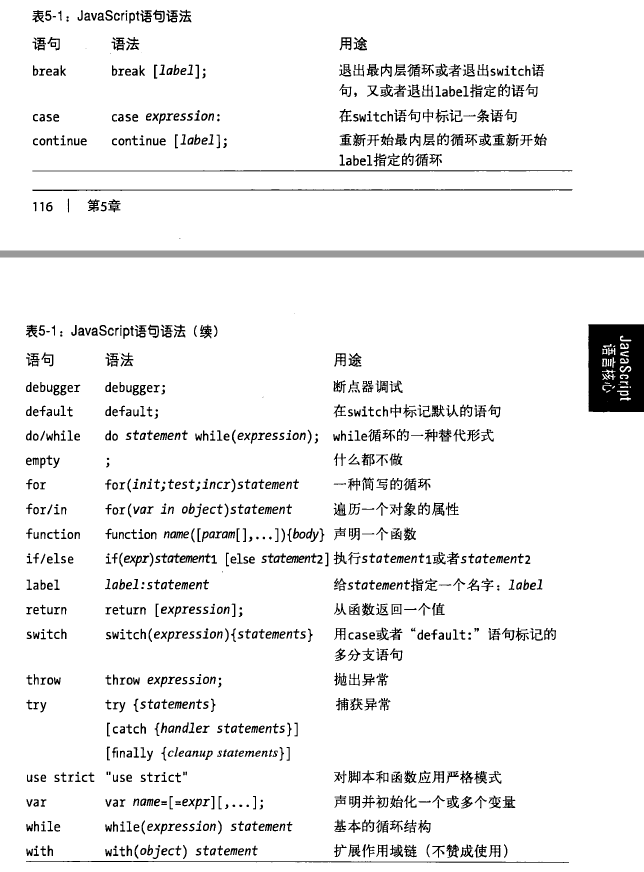

# 基础知识部分
_本篇主要对部分基础知识做一些补充说明，以便后续知识的理解_

>关键词语
- 编译器：
- 执行引擎
- 作用域

关键过程：**分词/词法分析**, **解析/语法分析**, **代码生成**


>简单说明 **编译器、执行引擎、作用域**
>这个部分，我就不过多的查资料，因为这部分可能牵扯到编译原理和JS词法分析的一部分知识，有兴趣的可以自行查阅相关资料

书籍《You Don't Know JS: Types & Grammar》上卷中有提到  
> **分词/词法分析**
    即将代码中的字符串分解为有意义的词法单元(token)，对于var a = 2; => var、a 、= 、2、;  
> **解析/语法分析**
    即将词法中分析出的词法单元组成语法结构树(AST)  
> **代码生成**
    即将语法结构树转换为可执行的代码

>几个名词的说明：  
    >**执行引擎**：从头到尾执行对JavaScript进行编译和执行  
    >**编译器**：负责编译代码  
    >**作用域**：负责收集和维护所有声明后的标识符的绑定以及查询  

>对 var a = 2;的解释：  
    >当编译器对其进行词法和语法分析时，会询问作用域是否已经已经存在一个名为a的标识符，如果存在了则忽略，如果不存在，作用域会在当前作用域中创建这个标识符对应的绑定;   
    >当引擎执行a = 2; 进行赋值时，引擎会询问作用域是否有存在a标识符的声明，如果有则进行赋值操作，如果没有，依据当前代码环境[是否严格模式]进行相应的处理(严格模式下会报错，而非严格模式下，会直接在全局声明一个变量)；

## 变量和函数声明
变量声明：即在作用域中创建一个标识符的绑定，当使用该标识符时，作用域对其进行查找并进行后续相应的操作。  

在ES5中对变量的声明有以下形式：
* function identifier   函数声明
* var identifier    普通变量声明
* identifier = value    非严格模式也会创建绑定

## 表达式与语句 
>陈述“逻辑与值”关系的过程，被称为表达式，表达式由运算符和运算元构成。
运算元包括了变量、函数的返回值、直接量。
运算符包括特殊符号和部分单词运算符。
可以存在没有运算符的运算元，但是没有运算元、孤立在代码中的运算符是不合法的，且每个表达式都是有值的。

表达式类别：
* 原始表达式：常量、变量、直接量    1, sum, /abc/
* 对象和数组的初始化表达式  {}, [1, 2]
* 函数定义表达式
* 属性访问表达式
* 调用表达式    即函数调用
* 算术表达式
* 关系表达式
* 逻辑表达式
* 赋值表达式


>纯粹陈述“逻辑”的过程，被称为语句  
>两个原则：  
>* 语句由;分隔
>* 除空语句和控制语句(break、continue、throw...)外，语句是有值的(由语句的最后一个表达式决定)




## 运算符的优先级和结合性[用到时，查资料即可]

## 标签声明
> 大多数人都会忽略标签语句这个概念，标签语句的本质还是代码块  
break label	表示跳出label标签语句之外  
continue label	表示跳转到continue所示开始位置
#### 示例如下
```js
function TagShow(){
    var label = 12,
        temp = undefined;
    label: {    // 标签语句中如果是多行代码，需要用{}包裹，则表示是同一个标签
        temp = 2;   // 标签内部语句不能与标签同名，但是变量可以与标签同名
    };
    label: for(var index = 1; index; index ++) {
        console.info(index);
        if( index === 3 ) break label;
    };
    label: for(var index = 1; index < 10; index ++) {
        if( index % 3 === 0 ) console.info(index);
        else continue label;
    }
}
TagShow();
```

