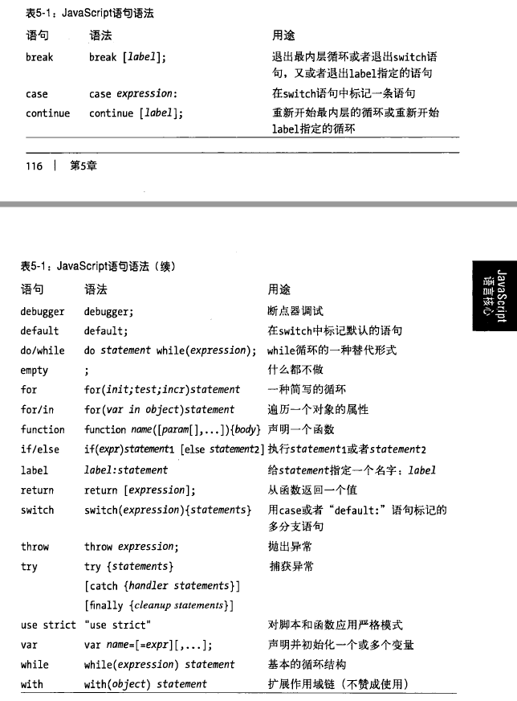

# 基础知识部分
_本篇主要对部分基础知识做一些补充说明，以便后续知识的理解_

## 编译与执行的一点说明
___传统编译过程：(编译原理)，JS引擎进行编译的步骤与之相似，但会复杂很多，编译与执行往往仅在 微秒 之间___
### 📌 某些关键术语：(例子来自《You Don't Know JS: Types & Grammar》)
> - ***分词/词法分析***：即将代码中的字符串进行拆分为有意义的词法单元(Token)，对于某句声明：
    ```js
    var a = 2;
    ```
    经过词法分析之后，解析为 var、a、=、2、;
> - ***解析/语法分析***：即将词法单元按照某种规则构建为抽象语法树(Abstract Syntax Tree, AST);
    对以上词法分析之后，可能会生成如下结构：
>
>                VariableDeclaration
>            ____________|____________
>            |                       |
>        Identifier(a)    assignmentExpression(=)
>                                    |  
>                            NumbericLiteral(2)   
> - ***代码生成***：将抽象语法树转化为机器可以执行的代码
<br />

<br />

### 📌 某些关键名词：
> * ***执行引擎***：整个JavaScript代码从头到尾参与，进行编译和执行代码
> * ***编译器***：对JavaScript进行编译，进行词法分析和语法构建
> * ***作用域***：在对代码的编译和执行过程中，收集并创建代码中标识的绑定，并提供查询机制，有一套严格的规范机制。  
    >_💡 作用域嵌套_：当一个代码块或函数嵌套在另外一个块或函数中时，就发生了作用域嵌套，而作用域是根据绑定标识符查找变量的规则。因此，当在当前所处作用域中无法查找到时，就会去外层查找，一直查找到最外层。又称 _自由变量寻址_。

```
📍 对 var a = 2;的解释：  
    当编译器对其进行词法和语法分析时，会询问作用域是否已经已经存在一个名为a的标识符，如果存在了则忽略，如果不存在，作用域会在当前作用域中创建这个标识符对应的绑定; 

    当引擎执行a = 2; 进行赋值时，引擎会询问作用域是否有存在a标识符的声明，如果有则进行赋值操作，如果没有，依据当前代码环境[是否严格模式]进行相应的处理(严格模式下会报错，而非严格模式下，会直接在全局声明一个变量)；
```

## 表达式和语句
_为什么会有突然说这个东西呢，因为我觉得这两个概念对JS而言比较重要，因为常出现一些晦涩难懂的语法或需要某些技巧性的操作，这两个概念就给我提供了思考的基础。_

JS语法对比于英语语法来说也有些相似的地方，英语中一个 _句子_ 就是表达一个完整的含义，而JS语句也是表达一个完整的含义，比如：var a = 2; 表示完成一个赋值的操作，为声明语句，而 a = 2 只能称之为 _赋值表达式_。

为什么 ; 这个符号会这么重要，也许我们在coding时，一般当前行都不写也能表示结束，这是分号自动补全机制在，如果你放到Java中，编译都过不去，所以加;表示一个完整的操作结束。

一个完整的句子，应该由短语或词组或单个的词构成，外加上一个标点符号。对比到JS中，也就是语句、表达式、运算符。__JS中的表达式是有值的。__
```js
var a = 1 + 2;
var b = a * 3;
```
对于上面简单的一行代码而言，1+2 是一个表达式，其值是3；a * 3也是一个表达式，其值是9；所以也就造成了 __语句也是有值的。__(_在Chrome控制台上打上 var a = 2; 会发现紧接着输出 undefined，因为是声明语句，所以是Undefined，直接打上 100; 会输出100，因为是单值语句_)
```js
var b = 13;
if( true ) b = 13 + 2;
```
直接在控制台上，输出的就是 15 了，语句的值由最后一个执行的表达式决定 _【除空语句和控制子句外】_。大部分可以拿eval测，或者使用浏览器控制台。例如
```js
var a = 13;
var b = (a++, 100); // 这里的()表示强制逗号表达式进行运算，并返回100
eval('a++, 100;');   // 100 这里看的清楚一些

// 控制子句 continue, break 空语句 ;
eval('100;;;;');    // 100
eval('var a = 100; for(var i=0; i<3;i++) { if(i===2) break; else a = i; }') // undefined 

```

#### 表达式种类
* 原始表达式：常量、变量、直接量    _1, sum, /abc/_
* 对象和数组的初始化表达式  _{}, [1, 2]_
* 函数定义表达式    _var fn = function_
* 属性访问表达式    _obj. or obj[key]_
* 调用表达式        _函数调用_
* 对象创建表达式    _new Object_
* 算术表达式        _+ - * / ..._
* 关系表达式        _> < == ..._
* 逻辑表达式        _&& || !_
* 赋值表达式        _=_

#### 语句分类
- 表达式语句        _表达式加 ;构成_
- 复合语句和空语句  _{} ;_
- 声明语句         _var, function_
- 条件语句          _if, switch_
- 循环语句
- 跳转语句      _label,break,continue,return,throw,try/catch/finally_
- 其他语句类型  _with,debugger,_

##### 标签声明
> 大多数人都会忽略标签语句这个概念，标签语句的本质还是代码块  
break label	表示跳出label标签语句之外  
continue label	表示跳转到continue所示开始位置
#### 示例如下
```js
function TagShow(){
    var label = 12,
        temp = undefined;
    label: {    // 标签语句中如果是多行代码，需要用{}包裹，则表示是同一个标签
        temp = 2;   // 标签内部语句不能与标签同名，但是变量可以与标签同名
    };
    label: for(var index = 1; index; index ++) {
        console.info(index);
        if( index === 3 ) break label;
    };
    label: for(var index = 1; index < 10; index ++) {
        if( index % 3 === 0 ) console.info(index);
        else continue label;
    }
}
TagShow();
```

## 操作符和运算元
_操作符也叫运算符_， 用于算术表达式、比较表达式、逻辑表达式等。大部分的运算符都是符号，比如 + - * 等等，也有少部分运算符是单词，比如 in，delete，instanceof，void等。运算元则是运算符操作的对象，有些运算符只需要一个运算元，比如 _++a_ ，有些需要两个，比如 _a + b_，_a && b_，也有三个的 _a ? b : c_ 等等...

_📍 运算符也是有顺序和优先级的_

___📑 表达式由运算符和运算元构成，语句由表达式构成，; 分隔___

___📑 可以存在没有运算符的运算元，但是没有运算元、孤立在代码中的运算符是不合法的，且每个表达式都是有值的。___
```js
var a = 1;
a           // 这是符合的，是个单独的单独运算元，也是单值表达式
a;          // 单值语句
;           // 也可以直接是一个空的表示，构成空语句，因为空格在js中是合法的
// ++;      // 单独的运算符是不符合语法的
```



## 垃圾收集
_这部分主要参考红皮书_
一般情况下，当执行的上下文退出，也就是当前执行栈弹出之后，与之有关的内存都会进行相应的清理，作用域会进行相应的释放，因为一些局部变量已经没有存在的必要。

常见的两种：
1. 标记清除
>当变量进入执行环境是，就标记这个变量为“进入环境”。从逻辑上讲，永远不能释放进入环境的变量所占用的内存，因为只要执行流进入相应的环境，就可能会用到他们。当变量离开环境时，则将其标记为“离开环境”。

2. 引用计数
>引用计数的含义是跟踪记录每个值被引用的次数。当声明了一个变量并将一个引用类型赋值给该变量时，则这个值的引用次数就是1。相反，如果包含对这个值引用的变量又取得了另外一个值，则这个值的引用次数就减1。当这个引用次数变成0时，则说明没有办法再访问这个值了，因而就可以将其所占的内存空间给收回来。这样，垃圾收集器下次再运行时，它就会释放那些引用次数为0的值所占的内存。


参考资料：  
    《You Don't Know JS: Types & Grammar》上卷  
    《JAVASCRIPT 语言精髓与编程实践》  
    《JavaScript 高级程序设计》  
    《JavaScript 权威指南》  
