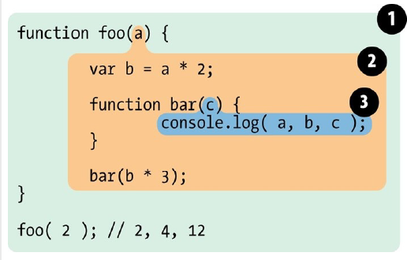

_本篇主要对闭包进行一些补充说明_

## 词法作用域和嵌套

### 定义
在JS中，作用域是一套规则，用来处理当前作用域及其子作用域标识符绑定和查询的规则。
而词法作用域就是定义在词法阶段的作用域，等同于在做词法分析时的作用域。间接理解就是你的变量写在哪里的，你的变量作用域就是在哪里。
做词法分析时，保持代码中变量作用域不变。

```js
var a = 1;
function outer(){
    var b = 2;
    function inner(c){
        var d = 10;
        console.info(a + b + c, d);    // 6, 10
    }
    inner(3);
}
outer();
// 因为词法作用域的缘故，outer里面不能访问到d，而inner可以访问到b
```

### 嵌套


① 处包含这全局作用域，且包含一个标识符foo  
② 处于foo所创建的词法环境里面，包含b 和 bar 两个标识符，且其外部词法环境是 ①  
③ 处于bar所创建的词法环境，包含c标识符，且外部词法环境是 ②  

通过嵌套的方式，构成作用域链形式，而各个作用域包含的代码在执行时，都会在当前作用域进行查找，如果没有就往外层查找，直到全局作用域。作用域的形成在 上一个 文章补充中已经阐述。

## 闭包
来看一下各种定义和解释：

JavaScript 高级程序设计：闭包是指有权访问另一个函数作用域中的变量函数

犀牛书原文：函数对象可以通过作用域链相互关联起来，函数体内部的变量都可以保存在函数作用域内，从技术角度讲，所有JavaScript函数都是闭包，当调用函数时闭包所指向的作用域链和定义函数时的作用域链不是同一个作用域链。
_即函数对象的执行与定义不在同一个作用域内_

JavaScript 语言精髓与编程实践：闭包是函数的代码在运行过程中的一个动态环境，是一个运行期的、动态的概念。且具有两个特点：
> 1. 闭包作为与函数成对的数据，在函数执行过程中处于激活状态
> 2. 闭包在函数运行结束后，保持运行过程的最终数据形态 

```js
function foo() {
    var a = 2;
    function bar(){
        console.info(a);
    }
    bar();
}
foo();
```
此时bar可以访问到 a，但这只是作用域对变量的寻址操作，并不是闭包
```js
function foo() {
    var a = 2;
    function bar(){
        console.info(a);
    }
    a ++;
    return bar;
}
var fn = foo(); //
fn();   // 3
```
当调用 foo 之后，内部定义的函数 bar 被作为foo函数调用的返回值返回，赋值给fn，调用fn时，仍然可以访问到 bar 定义时所在的作用域的一些标识符，且 a的值为3，表明访问的是定义bar作用域的最终数据状态。

一般来说，一个函数调用完之后，该执行环境中的一些状态和资源都会被清理，以此来释放内存，但是闭包却阻止了这类事情的发生。__导致bar仍然持有定义自己的作用域的引用，这个引用就是闭包__

__这个函数在定义时的词法作用域以外的地方被调用。闭包使得函数可以继续访问定义时的词法作用域__。

说一下循环：
```js
for(var i=1; i<=5; i++){
    setTimeout(function(){
        console.info(i);    // 6
    }, 1000 * i);
}
```
以上代码会连续输出五个6，6来自循环的条件，而setTimeout让回调函数不在定义的该函数的作用域内调用，可以间接理解为如下：
```js
var fns = [];
for(var i=1; i<=5; i++){
    fns.push(function(){
        console.info(i);
    });
}
fns.forEach(function(fn){
    fn();
});
```
fns中的每个函数都不在其定义的地方调用，都维持着一份外部作用域的引用，且是该外部的作用域是最终数据状态，也就是 for 循环执行完之后， i的值是6.

为啥下面可以：
```js
for(var i=1; i<=5; i++){
    (function ifee(index){
        setTimeout(function(){
            console.info(index);
        }, 1000 * index);
    })(i);   
}
```
因为setTimeout中的回调函数所持有的外部词法环境是ifee，通过ifee的自执行调用，i 的值已经被固化到index上，所以当setTimeout的回调函数执行时，访问的也就是ifee的 index。

<br />

参考资料：  
    《You Don't Know JS: Types & Grammar》上卷  
    《You Don't Know JS: Up & Going, ES6 & Beyond》下卷  
    《JAVASCRIPT 语言精髓与编程实践》  
    《JavaScript 高级程序设计》  
    《JavaScript 权威指南》